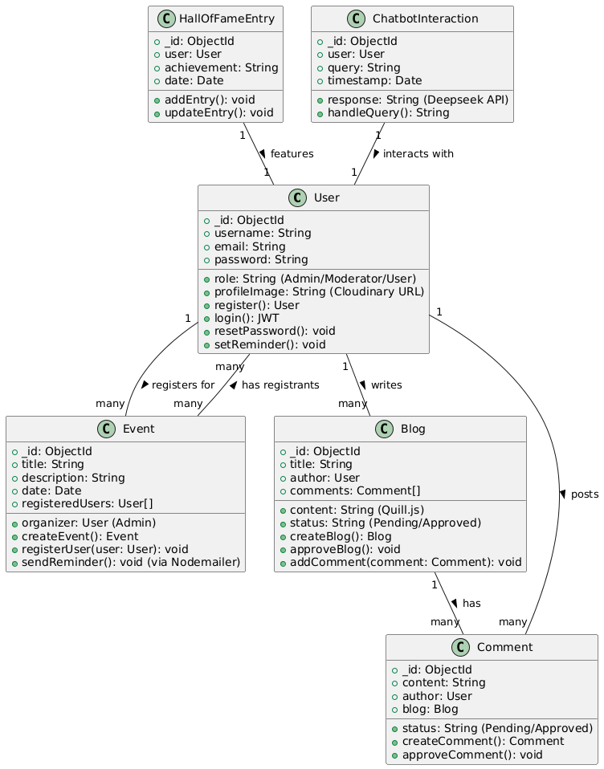

# DIU SWE HUB

## MERN-Based Event & Blog Platform with AI Chatbot

## Table of Contents

1. [Introduction](#introduction)
2. [Features](#features)
3. [Technology Stack](#technology-stack)
4. [System Architecture](#system-architecture)
5. [Database Diagram](#database-diagram)
6. [Class Diagram](#class-diagram)
7. [Project Proposal](#project-proposal)
8. [Installation](#installation)
9. [Usage](#usage)
10. [Contributing](#contributing)
11. [License](#license)

## Introduction

This project is a full-stack web platform built using the MERN stack (MongoDB, Express.js, React.js, Node.js). It allows users to register for contests/events, receive reminders, write blog posts, interact with an AI chatbot, and view a "Hall of Fame" for top participants. The system includes role-based authentication with admin and moderator functionalities.

## Features

- **User Authentication & Role Management**: Secure login with JWT, role-based access control.
- **Event Management**: Registration for contests, automatic email reminders.
- **Blog System**: User-generated content with approval workflow, comment system.
- **Hall of Fame**: Showcase top participants and achievements.
- **AI Chatbot**: Integrated with Deepseek API for automated user assistance.

## Technology Stack

- **Frontend**: React.js, Tailwind CSS
- **Backend**: Node.js, Express.js
- **Database**: MongoDB (Mongoose ORM)
- **Authentication**: JWT (JSON Web Token)
- **Chatbot**: Deepseek API
- **Styling**: Tailwind CSS
- **Email Service**: Nodemailer
- **Cloud Storage**: Cloudinary
- **Hosting**: Vercel (Frontend), Render/AWS (Backend), MongoDB Atlas (Database)

## System Architecture

The platform is divided into three main layers:

1. **Frontend (React.js)**: Uses React Router for navigation, with components for homepage, authentication, event management, blog section, and Hall of Fame.
2. **Backend (Node.js & Express.js)**: RESTful APIs for user authentication, event registration, blog management, and admin functionalities.
3. **Database (MongoDB Atlas)**: Stores users, events, blogs, comments, and reminders.

## Database Diagram

The database diagram illustrates the structure of the database, including tables and their relationships.


## Class Diagram

The class diagram provides an overview of the main classes and their interactions within the application.



## Project Proposal

For more detailed information about the project, including the proposal, timeline, and future enhancements, visit our [Project Proposal Website](link-to-your-project-proposal-website).

## Installation

1. Clone the repository:
   ```bash
   git clone https://github.com/your-username/your-repo.git
